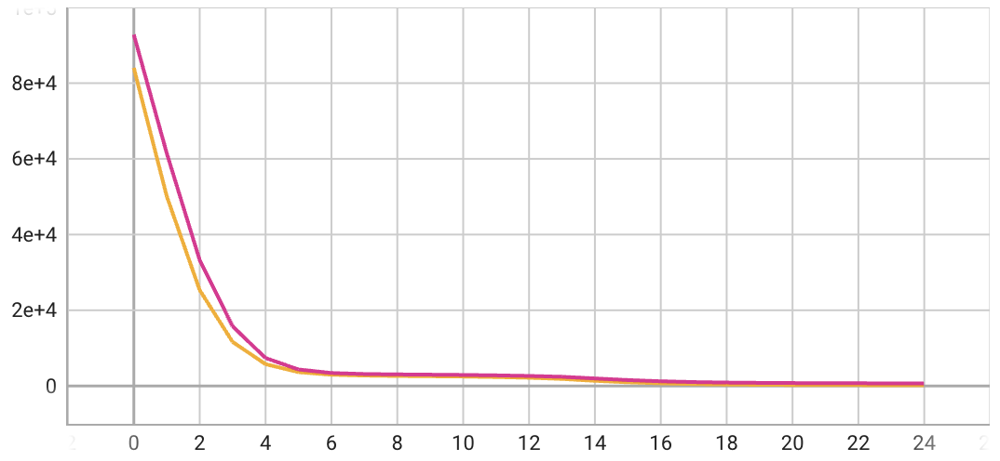
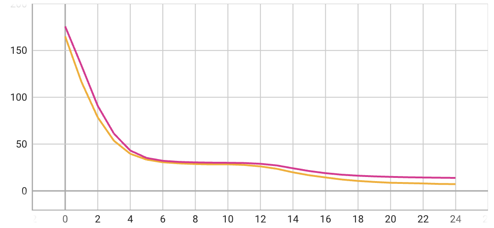

# MachineHack Hackathon Forecasting Solar-Energy-Efficiency
- [Hackathon Link](https://machinehack.com/hackathons/forecasting_solar_energy_efficiency_engage_in_the_challenge_and_win/overview)
- [Profile Link]()
## The Challenge
> 👋 Hello there! 👀 Are you up for the challenge of predicting solar energy efficiency? 🔮💡🌞 In this hackathon, you will use machine learning algorithms and weather data to forecast the power production of a city in a state. The state government is interested in estimating the efficiency of solar clear sky to understand the power production from solar energy.  
🧐 You will need to develop a model that accurately predicts solar energy production based on various weather data, such as temperature, humidity, cloud cover, and wind speed. You can use different machine learning techniques like regression, time-series analysis, and deep learning to build your model.  
🔎 To participate in this challenge, you can explore solar energy prediction datasets and codes on platforms like GitHub and Kaggle. You can also look into various solar forecasting methods, challenges, and performance metrics to improve your model's accuracy.  
💡 Additionally, you can research and analyze India's solar energy landscape to gain insights into the country's renewable energy goals, leading solar energy producers, and solar power plants.  
⚡️ Remember, accurate forecasting of solar energy production is crucial for efficient energy management and sustainability. So, join this challenge today, and win the opportunity to showcase your skills and contribute to a greener future. 🌿🌍
## Latest Results (Training-Dataset)
<b>Loss (MSE):</b> 

<b>MAE:</b> 
